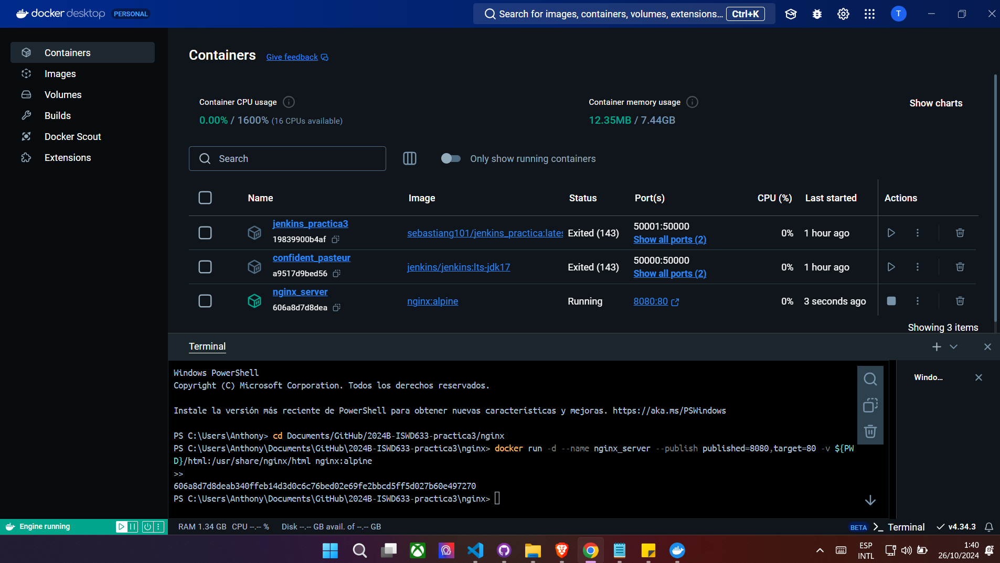

# VOLUMEN TIPO HOST
Un volumen host (o bind mount) es un tipo de volumen donde se monta un directorio o archivo específico del sistema de archivos del host en un contenedor.

```
docker run -d --name <nombre contenedor> -v <ruta carpeta host>:<ruta carpeta contenedor> <imagen> 
```
### En tu computador crear una carpeta llamada nginx y dentro de esta carpeta crea otra llamada html. Como se aprecia en la figura.


### Crear un volumen tipo host con la imagen nginx:alpine, mapear todos por puertos, para la ruta carpeta host colocar el directorio en donde se encuentra la carpeta html en tu computador y para la ruta carpeta contenedor: /usr/share/nginx/html (esta ruta se obtiene al revisar la documentación de la imagen)


# COMANDO:

    docker run -d -p 8080:80 --name nginx-server -v C:/Users/Anthony/nginx:/usr/share/nginx/html nginx:alpine

### ¿Qué sucede al ingresar al servidor de nginx?

    Al ingresar al servidor nginx se muesta el error 403 Forbidden, el cual significa que nginx no encontró un archivo válido para mostrar.

### ¿Qué pasa con el archivo index.html del contenedor?

    No existe un archivo index.html en el contedor, dado que en la carpeta host tampoco existe un archivo index.html. Por esta razón el contenedor muestra el error 403 Forbidden.

### Ir a https://html5up.net/ y descargar un template gratuito, descomprirlo dentro de tu computador en la carpeta html


### ¿Qué sucede al ingresar al servidor de nginx?

    Se muestra el template descargado.


### Eliminar el contenedor

    docker rm -f nginx-server

### ¿Qué sucede al crear nuevamente el mismo contenedor con volumen de tipo host a los directorios definidos anteriormente?

    Es posible observar el template previamente descargado, dado que al no encontrarse almacenado en el contenedor, no resulto afectado por la eliminación del anterior contenedor.

### ¿Qué hace el comando pwd?

    Muestra la ruta completa del directorio actual.

Si quieres incluir el comando pwd dentro de un comando de Docker, lo puedes hacer de diferentes maneras dependiendo del shell que estés utilizando.


### Volumen tipo host usando PWD y PowerShell
```
docker run -d --name <nombre contenedor> --publish published=<valorPuertoHost>,target=<valor> -v ${PWD}/<ruta relativa>:<ruta absoluta> <nombre imagen>:<tag> 
```

### Comando

    docker run -d --name nginx_server --publish published=8080,target=80 -v ${PWD}/html:/usr/share/nginx/html nginx:alpine



### Volumen tipo host usando PWD (Git Bash)

```
docker run -d --name <nombre contenedor> --publish published=<valorPuertoHost>,target=<valor> -v $(pwd -W)/html:/usr/share/nginx/html <nombre imagen>:<tag> 
```

### Volumen tipo host usando PWD (en Linux)

```
docker run -d --name <nombre contenedor> --publish published=<valorPuertoHost>,target=<valor> -v $(pwd)/html:/usr/share/nginx/html <nombre imagen>:<tag> 
```

